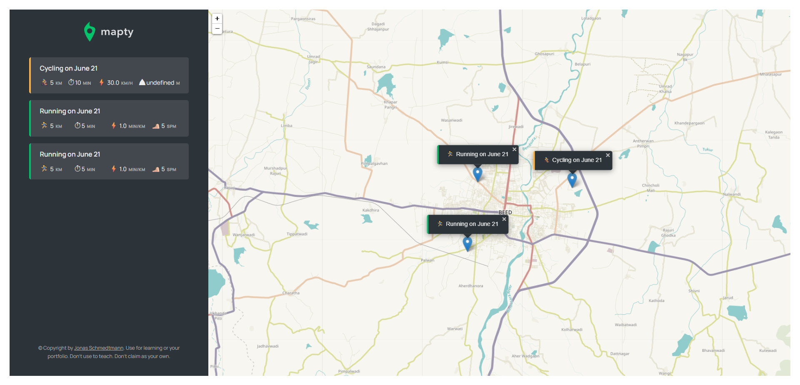

# Mapty 🗺️

**Mapty** is a workout tracking app that uses geolocation and mapping features to log running and cycling workouts. This project was built by following the **"JavaScript: The Complete Guide 2023 (Beginner + Advanced)"** course by **Jonas Schmedtmann** on Udemy.

> ⚠️ **Note**: This is not an original project. It was built as part of a learning course and is shared here solely for educational and portfolio purposes. All credit for the concept and design goes to Jonas Schmedtmann.

---

## 📸 Screenshot

---

## 🚀 Features

- Log running and cycling workouts with distance, duration, and cadence/elevation
- Display markers on an interactive map using Leaflet.js
- Automatically zooms to selected workout
- Stores data in browser using `localStorage`
- Object-oriented code structure (ES6+ classes)

---

## 🛠️ Built With

- HTML5
- CSS3
- JavaScript (ES6+)
- [Leaflet.js](https://leafletjs.com/)
- Geolocation API

---

